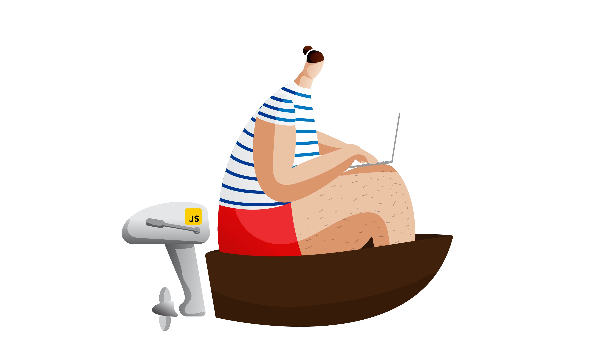

# Bringing a cartoon character to life

### SVG Character Animation with vanilla CSS

Live: [david-ahoy.surge.sh](https://david-ahoy.surge.sh)

---

It all started with an illustration following an incredible tutorial by "Cricket Design" on Youtube: [https://youtu.be/8WQH5ksCpwc](https://youtu.be/8WQH5ksCpwc)

It looked pretty cool already, but I decided to lose the fishing rod and add a computer as well as a motor. 

From there, I started building up the different exported layers of the illustration into an HTML file and pieced it back together with CSS. All vallues are percentages, so that the size can be dynamic.

---

### Animation

Using CSS `@keyframes` and `transition: transform()` extensively, I figured out what layer needed to do what and started playing with the animations. Often times, an animation plays on a parent `
`, which in turn affects all children elements as well. Then, these children elements can have their own animations. Think about moving the whole body (including the arm) first, and then specifying exactly what the arm needs to do with another animation.

Now the guy starts off by opening the laptop, the motor starts going, driving the boat forward. At this point the animation loops and he'll go on forever. How cool is that?! 🤓🥳

---

